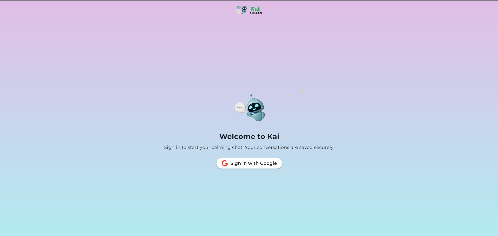
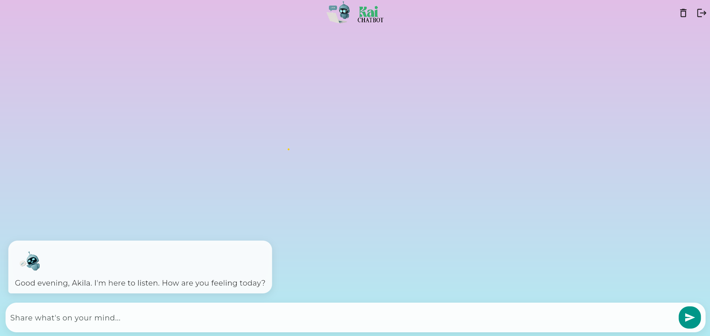
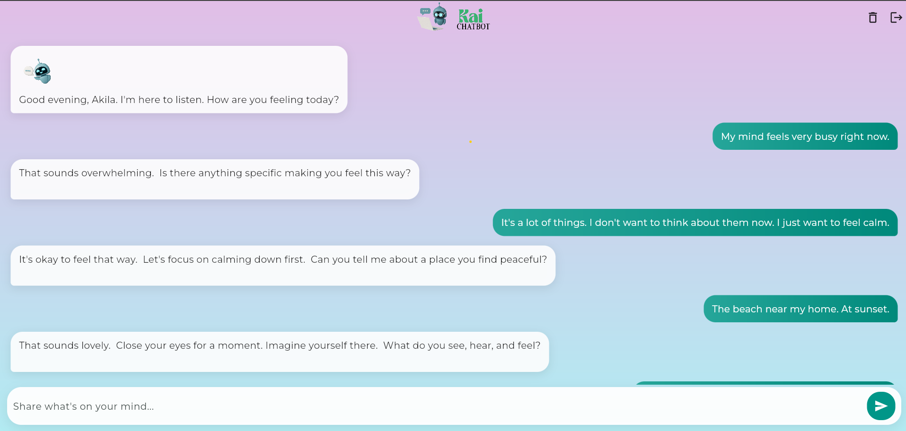

# Kai — Mind‑relaxing Chatbot (Flutter + FastAPI + Firebase)

A modern, calming chatbot that helps users de‑stress. Built with Flutter (Web + Android), a FastAPI backend, Google Sign‑In, and Firestore for chat history.

<p align="center">
  
  
  
</p>

---


## Features

- Calm gradient background and animated bubbles (flutter_animate)
- Google Fonts (Montserrat) and tasteful GIFs
- Transparent AppBar with appbar_Title.gif; welcome bubble shows welcom_chatbot.gif
- Google Sign‑In (Web + Android) required before chat
- Firestore persistence (resume latest conversation after sign‑in)
- Real‑time streaming of messages from Firestore
- One‑tap delete conversation (creates a fresh thread and seeds welcome message)
- Backend enforces wellbeing scope (stress, feelings, coping) and avoids greetings mid‑chat

---

## Contents

- [Architecture](#architecture)
- [Screenshots](#screenshots)
- [Prerequisites](#prerequisites)
- [Setup](#setup)
  - [Backend (.env)](#backend-env)
  - [Firebase (Android + Web)](#firebase-android--web)
- [Run](#run)
- [Configuration](#configuration)
- [Data model](#data-model)
- [Security rules](#security-rules)
- [Troubleshooting](#troubleshooting)
- [Roadmap](#roadmap)

---

## Architecture

- Flutter app (Web/Android)
  - Google Sign‑In
  - Streams conversation messages from Firestore
  - Sends user input to FastAPI `/chat` endpoint
- FastAPI backend (aura_backend)
  - Uses OpenRouter (Gemini Flash 1.5) via langchain‑openai
  - Conversation context is in memory per `conversation_id`
  - System prompt tuned for wellbeing, one question per message, no greetings

---

## Screenshots

<p align="center">
  
  
  
</p>

---

## Prerequisites

- Flutter SDK
- Python 3.11+
- Firebase project with Authentication (Google) + Firestore
- For Web: Chrome; For Android: Android SDK + Emulator

---

## Setup

### Backend (.env)

Create `aura_backend/.env`:

```
OPENROUTER_API_KEY=sk-...your-key...
```

Run backend:

```
python -m uvicorn aura_backend.main:app --host 0.0.0.0 --port 8000 --reload
```

### Firebase (Android + Web)

1) Install CLIs (one time)
```
dart pub global activate flutterfire_cli
npm i -g firebase-tools
firebase login
```

2) Configure project
```
flutterfire configure \
  --project flutter-chatbot-f8160 \
  --platforms=android,web \
  --android-package-name com.example.chatbotkai \
  --out lib/firebase_options.dart
```

3) Android: place `android/app/google-services.json` (download from Firebase console)

4) Web: add `localhost` and `127.0.0.1` to Firebase Auth → Authorized domains

5) Android debug SHA‑1 (for Google Sign‑In)
```
cd android
./gradlew signingReport
```
Add SHA‑1 and SHA‑256 to your Android app in Firebase settings, then re‑download `google-services.json`.

---

## Run

Web:
```
flutter pub get
flutter run -d chrome
```

Android emulator:
```
flutter run -d <emulator_id>
```

Note: Backend must be running on `http://localhost:8000` (Android uses `http://10.0.2.2:8000`).

---

## Configuration

- App assets
  - `assets/appbar_Title.gif` (AppBar title animation)
  - `assets/welcom_chatbot.gif` (landing/welcome bubble)
  - `web/Chatbot-icon.png` (favicon for web)
- Pub deps: http, google_fonts, flutter_animate, firebase_core, firebase_auth, cloud_firestore, google_sign_in, uuid, font_awesome_flutter

---

## Data model

Collections:

- `users/{uid}`
  - `latestConversationId: string`
  - `latestUpdatedAt: timestamp`
- `conversations/{cid}`
  - `ownerUid: string`
  - `createdAt: timestamp`
  - `updatedAt: timestamp`
  - `messages/{mid}`
    - `text: string`
    - `isUser: bool`
    - `assetPath: string | null`
    - `timestamp: timestamp`

---

## Security rules (development baseline)

```
rules_version = '2';
service cloud.firestore {
  match /databases/{db}/documents {
    match /conversations/{cid} {
      allow read, write: if request.auth != null
        && request.auth.uid == resource.data.ownerUid;
      match /messages/{mid} {
        allow read, write: if request.auth != null
          && get(/databases/$(db)/documents/conversations/$(cid)).data.ownerUid == request.auth.uid;
      }
    }
  }
}
```

---

## Troubleshooting

- Firebase isn’t configured yet
  - Run `flutterfire configure` to generate `lib/firebase_options.dart` and add `google-services.json`.
- Web auth error: `INTERNAL ASSERTION FAILED: Pending promise was never set`
  - Avoid double‑clicking Sign‑In. If it persists, clear cookies for `firebaseapp.com` and try again.
- Android cannot reach backend
  - Ensure backend runs on host and app uses `10.0.2.2:8000` (already handled in code).
- Disk space error on Windows
  - Set TEMP/TMP to a larger drive for the session: `$env:TEMP='D:\\Temp'; $env:TMP='D:\\Temp'`.

---

## Roadmap

- Conversation list / multi‑thread picker
- Restore model context from Firestore to backend for long sessions
- Theming & accessibility polish
- iOS/macOS support

---

© 2025 Kai Chatbot. All rights reserved.
